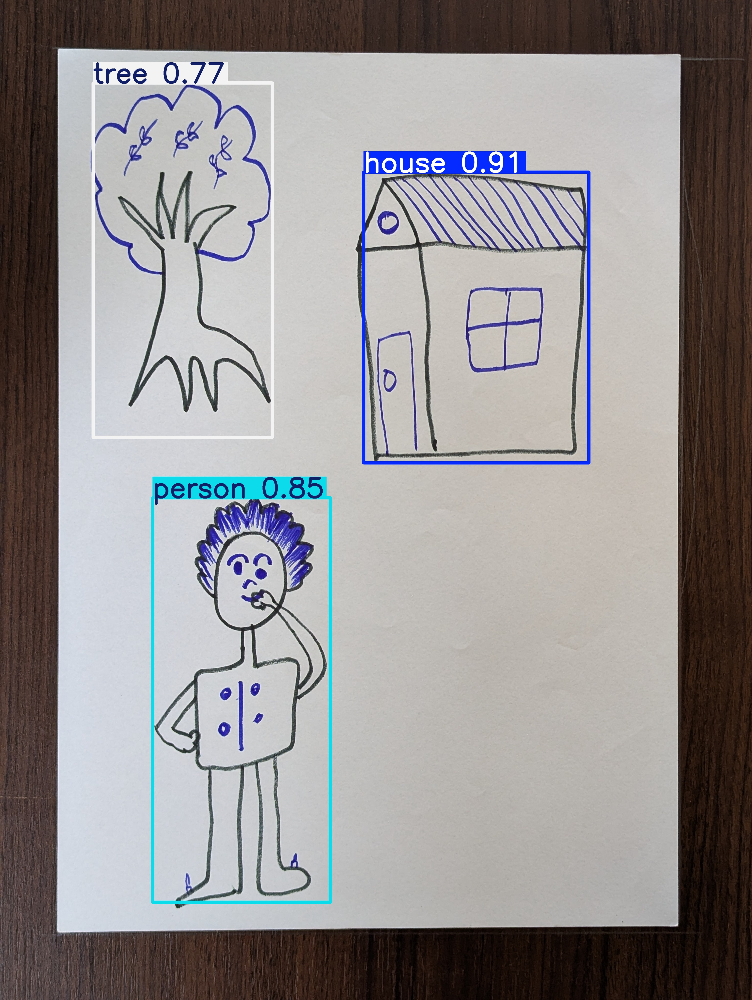

# HTP Drawing Analyzer
## Ancient Wisdom Meets Modern AI

HTP Drawing Analyzer is an AI-powered system designed to analyze
House-Tree-Person (HTP) drawings and generate structured psychological
interpretations. The system integrates object detection, vision-based
reasoning, retrieval-augmented generation (RAG), and prompt engineering
to simulate the analytical workflow of an HTP psychologist.

This repository presents two complete AI approaches, demonstrating the
evolution from a detection-centric pipeline to a hybrid vision-based
intelligent system.

---

## Project Highlights
- End-to-end AI system (not just a single model)
- Custom-collected HTP dataset
- YOLOv8-based object detection
- Vision-model-driven psychological reasoning
- Memory-aware user interaction
- Two distinct system architectures

---

## Data Collection

Due to the absence of publicly available datasets for HTP analysis,
the entire dataset used in this project was collected and curated manually.

### Human-Drawn Data
- Multiple on-campus data collection drives
- Drawings collected from students across departments
- All sketches followed the House-Tree-Person format
- Images were photographed, cleaned, filtered, and digitized manually

Total human-drawn images retained: approximately 105

### AI-Generated Data
To improve dataset robustness and diversity, AI-generated sketches were added.

Prompt used:
Draw on a blank A4 sheet using a pencil. The drawing should look like it
was made by a 5–6 year old child.

AI-generated images: approximately 95

### Final Dataset Summary
- Human-drawn images: ~105
- AI-generated images: ~95
- Total base dataset: 200 images
- After augmentation: 542 images

---

## Annotation and Augmentation
- Tool used: Roboflow
- Bounding boxes created for:
  - House
  - Tree
  - Person
- Augmentations applied:
  - Rotation
  - Brightness and exposure
  - Blur and noise
  - Shear transformations

---

## YOLOv8 Object Detection
- Model: YOLOv8
- Detection accuracy: approximately 98–99 percent
- Responsibilities:
  - Object detection
  - Area-based size classification

---

## YOLO Annotated Output

Example YOLOv8 detection result from the project:

Detected elements:
- Tree (confidence: 0.77)
- House (confidence: 0.91)
- Person (confidence: 0.85)

---

## Intelligent Size Classification

Instead of comparing objects with each other, the system:
- Computes bounding box area divided by total image area
- Assigns size labels:
  - Small
  - Medium
  - Large

This approach enables consistent and human-aligned interpretation.

---

## System Architecture

### Approach 1  
**YOLO + RAG (PDF + CSV + Database) + Chatbot**

User Interface Preview:

Pipeline:
1. YOLO detects objects in the drawing
2. RAG retrieves information from:
   - HTP psychology reference PDF
   - CSV feature dataset
   - User database
3. Chatbot generates the final interpretation

Strengths:
- Stable and reliable
- Maintains user identity and chat history
- Suitable as a baseline analytical system

Limitations:
- No deep visual understanding
- Fully dependent on YOLO detections

---

### Approach 2 (Final and Preferred)  
**YOLO + RAG (Database) + Vision Model + Prompt Engineering**

User Interface Preview:

Pipeline:
1. YOLO performs object detection and size classification
2. Vision model analyzes the drawing holistically
3. Prompt engineering enforces HTP psychologist reasoning
4. Database preserves user memory and interaction history

Why this approach is superior:
- Vision model compensates for YOLO detection limitations
- Rich, context-aware psychological interpretation
- Closest approximation to human-level analysis

This is the final production-grade system.

---

## Experimented Models and Key Learnings
- Random Forest: failed due to class imbalance and overfitting
- XGBoost: high accuracy but poor generalization

Key insight:
**High accuracy does not imply meaningful intelligence.**

---

## Technology Stack
- Python
- YOLOv8
- OpenAI Vision Model 4.1
- Roboflow
- Flask
- Retrieval-Augmented Generation (RAG)
- Prompt Engineering
- Google Colab
- CSV handling and database integration

---

## Project Status
Completed.  
Open for future research, scaling, and improvements.

---

## Acknowledgements
Project Supervisor:  
Abdullah Sajid  

Core Contributor:  
Zain (Sam)

---

This repository represents a complete AI system rather than a single model.
